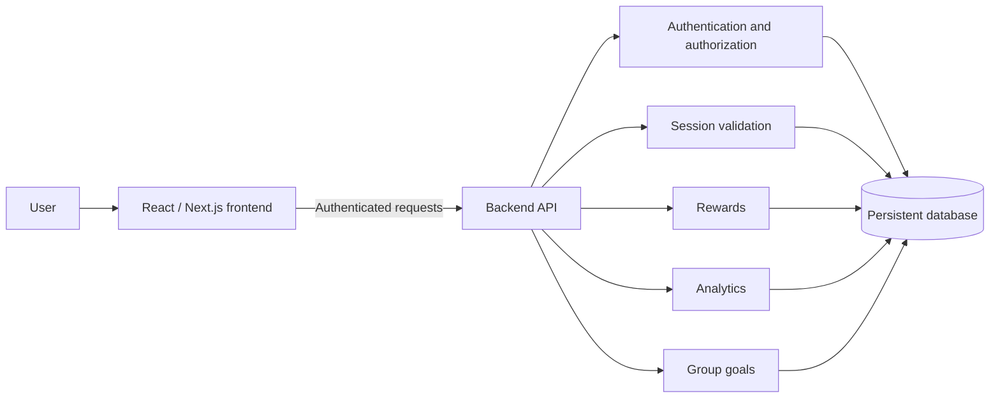

# DinoFocus

> Turn focused work into fossil discoveries.

DinoFocus is a free, web-based focus tracker that combines countdown and stopwatch sessions with collectible dinosaur fossils and personal time analytics. Users organize work with custom tags, complete sessions to uncover fossils, and review where their focused time went. Invite-only groups add shared accountability while keeping personal session history private.

> **Project status:** Planning and requirements (M1). Application features described below are planned deliverables for the Fall 2026 semester.

## Why DinoFocus?

People working across classes, projects, and creative pursuits often need help starting, staying consistent, and understanding how they spend their time. DinoFocus connects three useful feedback loops:

- **Focus:** Start a tagged countdown or stopwatch session.
- **Progress:** Complete valid sessions to reveal collectible fossils.
- **Insight:** Review totals, trends, streaks, and time by tag.

## Planned features

### Focus sessions

- Account creation and sign-in
- Countdown and stopwatch modes
- Custom tags for projects and activities
- Active-session recovery after a page reload
- Completed, cancelled, and failed session states
- Authoritative saved session history

### Fossil collection

- Fossil progress earned from valid completed minutes
- Partial and completed fossil displays
- A museum for collected fossils
- Configurable reward pacing
- Exactly-once backend reward updates to prevent duplicate progress

### Personal analytics

- Date-range totals
- Daily and weekly trends
- Focus streaks
- Time breakdowns by tag

### Private groups

- Invite-only membership
- Owner-managed invitations and members
- Weekly group goals
- Contributions derived from valid completed sessions
- Aggregate progress without exposing private notes or unrelated history

## Core workflows

### Personal focus

1. Sign in.
2. Select countdown or stopwatch mode.
3. Choose a tag and fossil.
4. Start working.
5. Complete or cancel the session.
6. On valid completion, save the session and update fossil progress, the museum, and analytics.

If the page reloads during an active session, DinoFocus restores its saved state.

### Group accountability

1. A group owner creates a private group and sets a weekly goal.
2. The owner invites other users.
3. Invited, authenticated users join the group.
4. Members' valid completed sessions contribute to the shared goal.
5. Members see aggregate progress and contributions while personal data remains private.

## Architecture

The backend validates identity, permissions, and state before reading or writing data. Saved session history is the source of truth for analytics, fossil rewards, and group contributions.

Planned persistent entities include:

- Users
- Focus sessions
- User-owned tags
- Fossil definitions
- Per-user fossil progress
- Groups
- Memberships
- Invitations

The exact backend and database technologies will be selected during M2 design.

## Key product rules

- Only valid completed minutes award fossil progress.
- The backend calculates and applies each reward exactly once.
- Repeated completion requests cannot duplicate a reward.
- Users cannot directly set fossil progress.
- Completed timing and state records remain authoritative; history edits are limited to safe metadata.
- Group membership and access are enforced on the server.
- Private notes and unrelated personal history are hidden from group members by default.

## Acceptance criteria

The first complete release should demonstrate that:

- Starting a tagged session saves its start time and tag, and refreshing restores the active state.
- Completing a valid session creates one permanent record, applies one reward, and updates the museum.
- Dashboard totals and breakdowns match completed sessions within the selected date range.
- Valid sessions from current group members update the group's weekly total.
- Only invited, authenticated users can join a group, and removed users lose access.
- Direct API requests from non-members are rejected.

## Roadmap

| Milestone | Planned outcome |
| --- | --- |
| **M2** | Finalize design decisions, API contracts, backend, and database technology. |
| **M3 — MVP** | Sign in, start a tagged session, complete and save it, reveal a fossil, and update a simple dashboard. |
| **M4** | Add multiple fossils, the museum, editable tags, weekly/monthly analytics, and basic group goals. |
| **M5** | Complete invitations, privacy controls, accessibility, integration tests, and the deployed demo. |
| **M6** | Finish responsive polish, validate analytics, and prepare the final demo. |

## Out of scope for v1

- Native mobile apps
- Phone-, OS-, or browser-extension-level blocking
- Public feeds, direct messages, or comments
- AI coaching
- Payments or a marketplace
- Instructor or gradebook monitoring
- Advanced anti-cheat systems
- Copyrighted franchise assets
- Custom animation for every dinosaur

Fossil artwork will use a reusable reveal component and project-appropriate assets.

## Team

| Team member | Primary ownership |
| --- | --- |
| [Calvin Chau](mailto:calvin.chau@stonybrook.edu) | Frontend product flows: timer, fossil reveal, dashboard, component consistency, frontend integration, and demo readiness. |
| [Arshdeep Singh](mailto:arshdeep.singh.1@stonybrook.edu) | Frontend and deployment: group pages, responsive layout, accessibility, deployment pipeline, environment configuration, and release verification. |
| [Saksham Sharma](mailto:saksham.sharma@stonybrook.edu) | Backend authentication and sessions: authentication, data models, focus-session API, timer validation, state tests, and reliability. |
| [Jason Yamashita](mailto:jason.yamashita@stonybrook.edu) | Backend rewards and analytics: fossil progression, analytics queries, group-goal data, schema refinements, and integration tests. |

Frontend and backend owners will agree on API contracts before implementation. Data-shape changes should be documented, and each meaningful pull request should be reviewed by a teammate outside the author's primary workstream.

## Open design decisions

Before implementation, the team will define:

- Timer completion and failure rules
- Safely editable session fields
- Streak and time-zone boundaries
- Invitation expiration behavior
- How membership changes affect weekly totals
- Final fossil reward pacing

The current reward example—60 completed minutes revealing 40% of a fossil—is a configurable starting point, not a final rule.

## Contributing

Development and contribution instructions will be added after the M2 architecture and tooling decisions are finalized.

## License

No license has been selected yet. Add a `LICENSE` file before distributing or accepting outside contributions.
