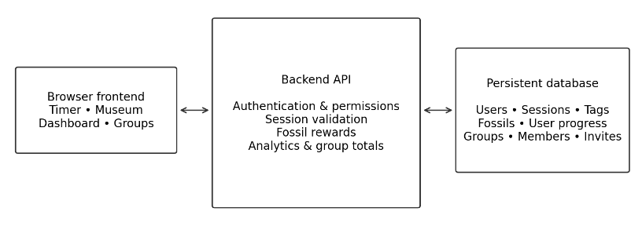

# DinoFocus

M1 — Proposal and Requirements | CSE 416 | Fall 2026

# **1\. Problem and users**

DinoFocus is a free web application that combines focus sessions, collectible dinosaur fossils, and personal time analysis. Users complete tagged work sessions to uncover fossils and build a useful record of where their time went.

Primary users are individuals managing focused work across projects or activities, including students, professionals, freelancers, developers, and creators. They need help starting and finishing work, visible progress that encourages repeat use, and a breakdown of time by activity. Small groups of friends, classmates, teachers and their students, or coworkers also need shared accountability without exposing private session history.

These needs and the motivational value of fossil collecting are product hypotheses informed by team experience. However, interviews have not yet validated them.

## **User → need → requirement**

| User | Need | Demonstrable behavior |
| :---- | :---- | :---- |
| Individual working across projects | Start work and understand time use | Start a tagged timer or stopwatch; recover it after a reload; review saved time by tag and date. |
| User motivated by collecting | See progress from completed work | Complete a valid session to reveal part of a fossil and update the museum. |
| Invited accountability-group member | Work toward a shared goal privately | Contribute completed minutes to a weekly group goal; show aggregate contributions only. |

# **2\. Why this needs a semester**

The semester is needed to integrate several workflows over shared, persistent data. Accounts own sessions, tags, fossil progress, and group memberships. The session engine must handle countdown and stopwatch modes, cancellation, reloads, and repeated completion requests. Each valid completion must consistently update rewards, personal analytics, and eligible group totals. Groups add invitations, membership permissions, and privacy checks. Frontend, backend, database, testing, and deployment must work together as one usable application.

# **3\. Scope and core workflows**

## **v1: completed semester release**

Web accounts; countdown and stopwatch sessions; custom tags; recoverable active sessions; saved session history; configurable fossil rewards; a museum of partial and completed fossils; date-range totals, trends, streaks, and tag breakdowns; simple invite-only groups with weekly goals; and a deployed application.

## **Delivery schedule**

M3 MVP: sign in → start a tagged session → complete it → save the result → reveal a fossil → update a simple dashboard.

M4 adds multiple fossils, the museum, editable tags, weekly/monthly analytics, and basic group goals. 

M5 completes invitations, privacy controls, accessibility, integration tests, and the deployed demo. 

M6 focuses on responsive polish, validated analytics, and the final demo.

## **Explicitly not included in v1**

Native mobile apps; phone/OS-level or browser-extension blocking; public feeds, direct messages, or comments; AI coaching; payments or a marketplace; instructor/gradebook monitoring; advanced anti-cheat; copyrighted franchise assets; and custom animation for every dinosaur. Fossil artwork uses a reusable reveal component and project-appropriate assets.

## **Personal workflow**

Sign in; choose countdown or stopwatch, a tag, and a fossil; start working; complete or cancel. A valid completion saves the session and updates fossil progress, museum state, and analytics. Reloading restores the active session.

## **Group workflow**

An owner creates a group, sets a weekly goal, and invites members. Invited authenticated users join; valid completed sessions contribute to the goal. Members see aggregate progress and contributions. Owners manage membership; private notes and unrelated history stay hidden by default.

# **4\. Functional requirements**

| Area | Required behavior |
| :---- | :---- |
| Accounts and sessions | Create an account and sign in; start countdown or stopwatch sessions with a tag and fossil; preserve active/completed sessions; distinguish completed, cancelled, and failed states. |
| Organization and history | Create/edit tags, categorize work, and review past sessions. Limit history edits to safe metadata; completed timing/state records remain authoritative. |
| Fossil rewards | Award progress only for valid completed minutes. The backend calculates each reward exactly once; users cannot directly set progress. Show partial/completed fossils and repeated completions; keep pacing configurable. |
| Personal analytics | Calculate date-range totals, daily/weekly trends, streaks, and time by tag from saved completed sessions. |
| Private groups | Support owner-managed invitations/membership and weekly goals. Enforce membership on the server; derive contributions from valid member sessions. |

# **5\. User stories and acceptance criteria**

## **US-1 — Start a tagged session**

As a user, I want to start a tagged focus session, so that my work is organized by project or activity.

Accept when: sign-in plus duration/tag selection and Start creates an active session; the start time and tag are saved; refreshing restores its state.

## **US-2 — Reveal a fossil**

As a user, I want completed focus time to reveal a fossil, so that my work creates visible progress.

Accept when: a valid completion creates one permanent record; the configured reward is applied exactly once; the museum updates without manual database changes. Repeating the completion request does not double the reward.

## **US-3 — Understand my week**

As a user, I want a weekly dashboard, so that I can understand where my focused time went.

Accept when: the selected range shows total time, a tag breakdown, and a trend or streak view; totals match completed-session records for that range.

## **US-4 — Contribute to a shared goal**

As a group member, I want my completed minutes to count toward a shared goal, so that consistent work feels accountable and motivating.

Accept when: valid sessions from current members update group totals; private notes and unrelated personal history are hidden by default.

## **US-5 — Keep groups private**

As a group owner, I want invite-only membership, so that random users cannot view or contribute to our group.

Accept when: only invited authenticated users can join; removed users lose access; direct API requests from non-members are rejected.

# **6\. Rough architecture and shared data**

The browser sends authenticated requests to the backend; the backend validates permissions and state before reading or writing the database. A valid session completion records the result and applies the reward once. Analytics and group totals derive from the same saved session history.

Frontend: React/Next timer, fossil reveal, museum, dashboard, and group pages. Backend: authentication, session-state validation, rewards, analytics, and group authorization. Persistent data: users, focus sessions, user-owned tags, fossil definitions, user fossil progress, groups, memberships, and invitations. Exact backend/database technology is selected during M2 design.

Session records retain owner, mode, start/end time, duration, tag, and status. Fossil definitions remain separate from per-user progress. Membership records connect users to groups and roles. Stored session history is the source of truth for auditing analytics and rewards.

# **7\. Named team ownership**

| Team member | Primary ownership |
| :---- | :---- |
| [calvin.chau@stonybrook.edu](mailto:calvin.chau@stonybrook.edu) | Frontend product flows: React/Next timer, fossil reveal, dashboard, component consistency, frontend integration, and demo readiness. |
| [arshdeep.singh.1@stonybrook.edu](mailto:arshdeep.singh.1@stonybrook.edu) | Frontend and deployment: group pages, responsive layout, accessibility, deployment pipeline, environment configuration, and release verification. |
| [saksham.sharma@stonybrook.edu](mailto:saksham.sharma@stonybrook.edu) | Backend authentication and sessions: authentication, user/session models, focus-session API, timer validation, state tests, and reliability. |
| [jason.yamashita@stonybrook.edu](mailto:jason.yamashita@stonybrook.edu) | Backend rewards and analytics: fossil progression, analytics queries, group-goal data, database schema refinements, and integration tests. |

Integration: frontend and backend owners agree on API contracts before implementation. Document data-shape changes and keep the specification current. Each meaningful pull request receives review from a teammate outside the author’s primary workstream.

## **Design decisions to close before implementation**

Specify timer completion/failure rules, safe editable session fields, streak/time-zone boundaries, invitation expiry, and how membership changes affect weekly totals. The initial reward example is 60 completed minutes \= 40% fossil reveal; validate and configure pacing before treating it as final.

# **8\. What we completed for M1**

We defined DinoFocus’s problem, target users, and core product: a web application where tagged focus sessions uncover dinosaur fossils and create useful time analysis. We established the personal MVP, the broader v1 scope, and explicit exclusions to keep the semester project manageable.

Our written M1 artifacts include functional and usability requirements, five user stories with acceptance criteria, a rough architecture sketch, shared-data responsibilities, and named ownership for all four team members. Together, these describe the proposed product and its implementation boundaries. The completed work presented here is proposal and requirements development; the application features are planned deliverables.

# **9\. Design choices and why**

We chose web-first delivery to reduce installation friction and keep one application to integrate, test, and deploy. Flexible tags support studying, professional work, and personal projects without making the product school-specific.

We selected dinosaur-fossil excavation because percentage-based progress works with reusable static artwork. This gives users a visible reward while keeping collectible variety feasible without custom animation for every species.

We designed saved focus sessions as the common source for rewards, analytics, and group contributions. Backend validation and exactly-once reward updates address duplicate requests and inconsistent totals. Invite-only groups with aggregate views provide accountability while protecting personal history. We prioritized the personal session-to-reward-to-analytics loop so group features build on a reliable foundation.

# **10\. How the team worked, including AI**

We organized the project into four named workstreams: frontend product flows; frontend group features and deployment; backend authentication and sessions; and backend rewards and analytics. The ownership table identifies each person’s responsibilities and the interfaces where frontend, backend, and shared data must connect.

We used AI to help condense and organize the proposal, clarify its alignment with M1, and draft explanations of the design choices. We directed the revisions by identifying the required M1 content, removing repetition, and retaining the product scope, acceptance criteria, architecture, and team responsibilities.

AI supported documentation and wording; the project concept, scope, and named responsibilities came from the supplied team proposal. The resulting document separates defined requirements from unvalidated user assumptions and unresolved design details. The team retains responsibility for product decisions and for verifying AI-assisted work.
