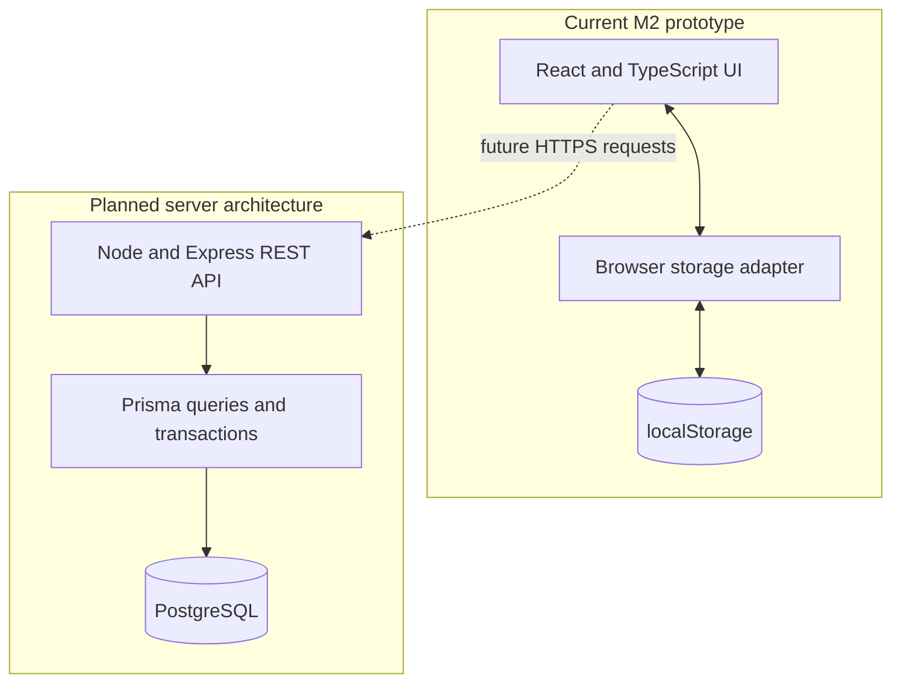

# DinoFocus M2 design

## Scope and evidence

DinoFocus helps anyone organize focused work, see progress, and review how they spent their time. This M2 prototype demonstrates the personal workflow through the actual React UI with clearly labeled fictional history. It uses browser storage. Authentication, server validation, database persistence, groups, and progressive fossil artwork are not implemented.


## Three core use cases

| Requirement | User need | M2 interaction | Remaining work |
| --- | --- | --- | --- |
| 1: Start a tagged session | Start a manageable block of work and keep its context | Choose tag and duration, start, reload, finish or cancel | Accounts, authoritative server timing, custom tags |
| 2: Reveal a fossil | See a visible reward for completed effort | Saved minutes update a percentage and remaining-minute count in Focus and Museum | Progressive artwork, multiple fossils, server-enforced rewards |
| 3: Understand my week | Understand where focused time went | Dashboard shows all-time totals and tag breakdown; History lists sessions | Weekly/date filters, trends, streaks |

The M2 dashboard is an all-time prototype of US-3. It does not yet satisfy the entire weekly-dashboard acceptance criterion. Groups remain a labeled future screen and are outside these three demo flows.

## UI design process

The M1 proposal defined the personal workflow and broader group scope. The initial frontend turned that workflow into a Focus page with adjacent reward feedback, persistent navigation, and separate review pages. The M2 demo revision adds a populated sample workspace and an explicit reset action so the same UI can demonstrate saved history and a reward threshold repeatedly.

The rationale for the layout is to keep starting a session simple: mode, activity, duration, and one primary start action. The save action remains disabled until the session is eligible. Adjacent fossil progress explains the connection between effort and rewards. Tags apply to studying, professional work, reading, or creative projects. Dashboard and Museum stay secondary to the timer.

## Architecture



The current browser interval redraws the display once per second. It calculates elapsed time from a saved start timestamp and recovers the active timer after reload. It is not a backend job. No background job service is required for M2. The target architecture validates completion synchronously in an API transaction; future scheduled tasks can be added only if a concrete requirement needs them.

Frontend responsibilities: input, navigation, countdown/stopwatch display, local active-session recovery, and rendering totals derived from completed sessions.

API responsibilities (planned): authenticate the user, authorize record ownership and membership, validate session transitions, determine credited seconds, and apply rewards exactly once. The browser is not a trusted source for completed time.

Database responsibilities (planned): persistent users, session state, tags, fossil definitions/progress, groups, memberships, and invitations. Store a unique reward application per session and apply completion and reward changes atomically. Analytics should derive from the same completed records.

## Stack and reasons

| Technology | Status | Reason |
| --- | --- | --- |
| React + TypeScript | Implemented | Reusable views and typed session data keep the frontend consistent. |
| Vite | Implemented | Runs and builds a standalone frontend without requiring backend services. |
| Node + Express | Proposed in supplied deck | Uses TypeScript/JavaScript across the client and API. |
| PostgreSQL + Prisma | Proposed in supplied deck | Relational constraints and typed queries suit sessions, ownership, and memberships. |
| GitHub Actions | Configured | Runs the repository's lint, test, and build scripts on frontend changes. |

## Shared records and proposed API contracts

| Record | Important fields or constraints |
| --- | --- | --- |
| User | id, email (unique), passwordHash |
| FocusSession | id, userId, tagId, fossilId, mode, startedAt, completedAt, creditedSeconds, status |
| Tag | id, userId, name |
| Fossil | id, name, species, requiredMinutes |
| FossilProgress | userId, fossilId, minutesEarned, completedAt; unique user/fossil pair |
| RewardApplication | sessionId (unique), fossilId, creditedSeconds |
| Group | id, ownerId, weeklyGoalMinutes |
| Membership | groupId, userId, role; unique group/user pair |
| Invitation | groupId, invited identity/token hash, expiresAt, acceptedAt |

Proposed routes, all under `/api`:

- `POST /auth/register`, `POST /auth/login`, `POST /auth/logout`, `GET /auth/me`
- `POST /sessions`, `GET /sessions`, `GET /sessions/active`
- `POST /sessions/:id/complete`, `POST /sessions/:id/cancel`
- `GET /fossils`, `GET /fossils/progress`, `GET /analytics`
- Group and invitation endpoints follow when the private-group workflow is implemented.

Example completion request: `POST /api/sessions/:id/complete`. The server looks up the authenticated user's active session, checks elapsed time and state, and returns the authoritative completed session plus updated fossil progress. Repeating the request returns the existing result without another reward. The client does not submit authoritative reward values. Error/loading states and asynchronous API calls are future frontend integration work.

## Prototype rules and sample data

Countdown: credit the selected duration only after it has elapsed. Stopwatch: allow saving after at least 60 seconds, crediting elapsed seconds. Cancellation adds no session and no reward. Repeated completion of one saved start timestamp does not duplicate a local record. These client checks demonstrate the interaction, not production security.

Ordinary workspace keys remain `dinofocus.demo.sessions.v1` and `dinofocus.demo.active.v1`. Opening `?demo=sample` selects separate `dinofocus.m2.sample.*.v1` keys. It seeds only when the sample history is absent or unreadable, then persists subsequent completions. Reset affects only that sample workspace. Sample dates are relative to the first load/reset and do not move on every refresh.

Fixture: 8 sessions, 149 minutes, 45 Deep work, 49 Studying, 30 Reading, and 25 Creative work. With the existing 150-minute illustrative target, `floor(149 / 150 * 100)` is 99%. Completing one actual one-minute Deep work countdown produces 9 sessions, 150 minutes, 46 Deep work minutes, and 100% progress. The skeleton remains static. These values are fictional demo records, not usage metrics.

## Repository setup and CI

Use a supported Node installation (the repo requires Node >=22.18; CI uses Node 24):

```sh
cd frontend
npm ci
npm run dev
```

Open the address printed by Vite with `/?demo=sample` appended. Keep the same origin and port for reload recovery. No database, account, API keys, or environment variables are needed.

```sh
npm run lint
npm test
npm run build
```

`.github/workflows/frontend.yml` already runs dependency installation, lint, tests, and build for matching pushes and pull requests. Local success does not prove the GitHub workflow has run on a newly pushed commit. Check the Actions tab after the team commits the changes.

Tests cover timer recovery, early completion rejection, duplicate completion, stopwatch minimum duration, cancellation, corrupt data fallback, fixture arithmetic, sample persistence, and isolation from ordinary storage.

